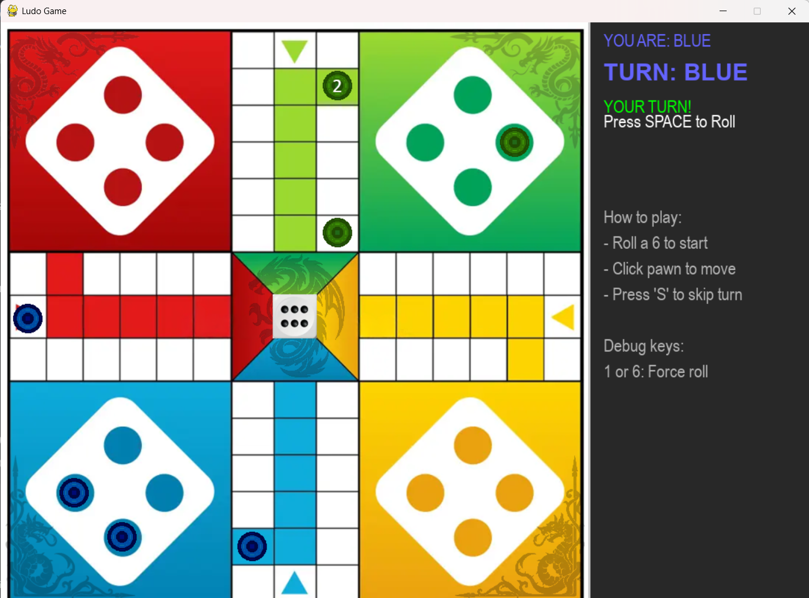

# LUDO GAME FOR 2 PLAYERS BASED ON TCP COMMUNICATION

* Authors: 
- Szymon Skarbek (Game design and game logic)
- Anna Radosz (server-client connection and documentation) *

## What is ludo?
Ludo is a classic turn-based game. The point of the game is to race your 4 colored pawns from starting base to the center of the board (home) according to the rolls of a single die.

## Project's file structure:
- assets folder - contains all neccessary graphics.
- constants.py - a file containing all constants needed for graphics of the UI
- round.py - logic of a single round-contains information about current player and allows for changing player as the round ends
- game_logic.py - contains all the logic for Pawn and Dice classes. Allows us to control pawn and dice visualisation, dice animation and the logic behind pawn movement and capture.
- server.py - class responsible for server initialization and running. Most of the game logic is done on the server. It connects for the client in GUI.py using TCP communication.
- GUI.py - the heart of the client side communication. It is responsible of visualisation of UI for it's client. It sends all messages created by clicking certain keys by the client to the server using TCP connection. It also receives neccessary information from the server needed for proper visualisation.

## Technical Implementation & Concurrency
The project utilizes **multithreading** to ensure a smooth user experience and reliable communication:
- **Server-side:** Each connected client is handled by a separate `threading.Thread`, allowing for concurrent message processing.
- **Client-side:** A dedicated background thread `listenToServer` is used to receive data from the server without freezing the Pygame main loop.
- **Synchronization:** To prevent race conditions during game state updates, `threading.Lock` is implemented within the `LudoServer` class.

## How to run
1. Clone the repository
2. Install pygame using "pip install pygame"
3. Run server using command "python server.py"
4. Run two instances of game using "python GUI.py"

## External libraries/frameworks used:
- pygame
- threading
- sockets
- json
- random
- time
- sys